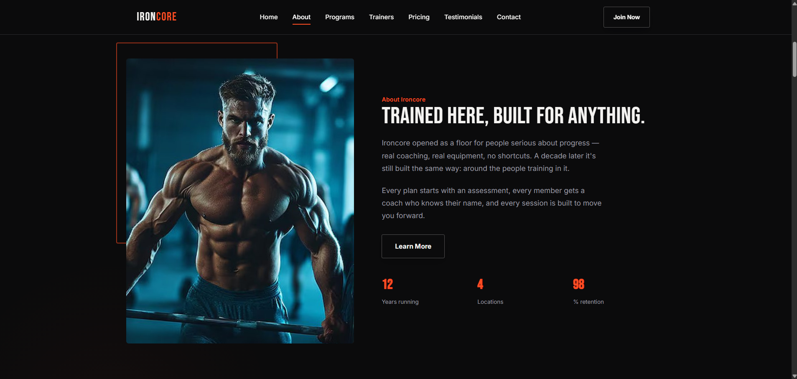
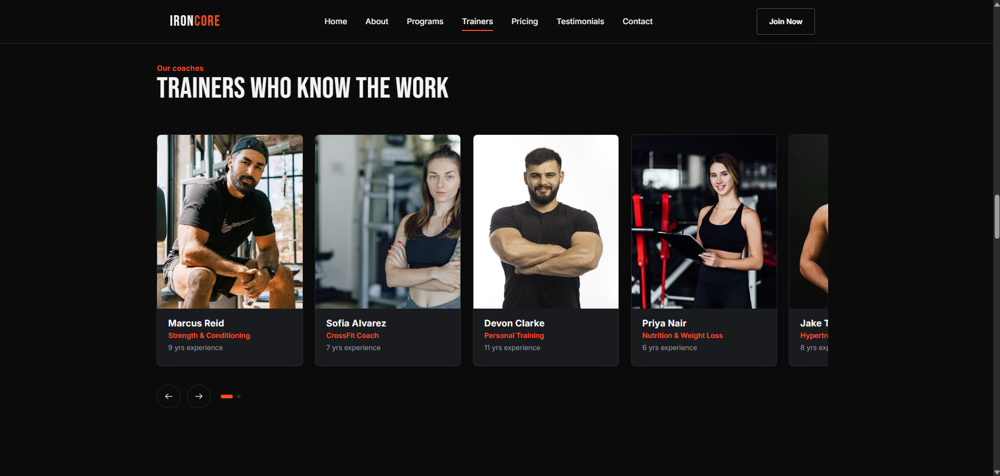
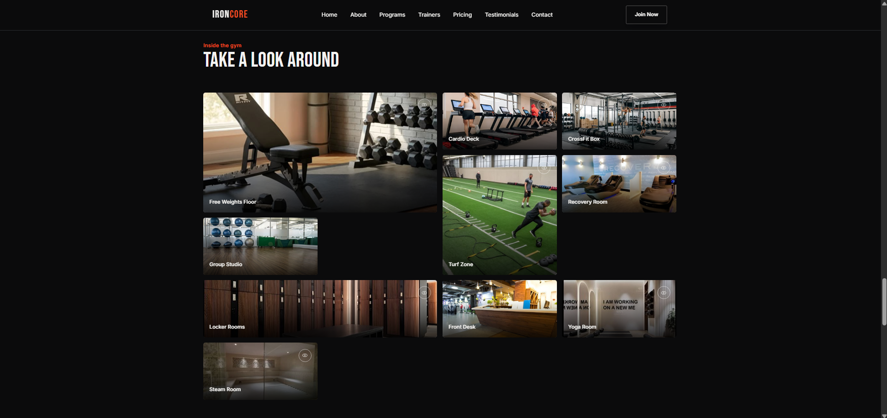
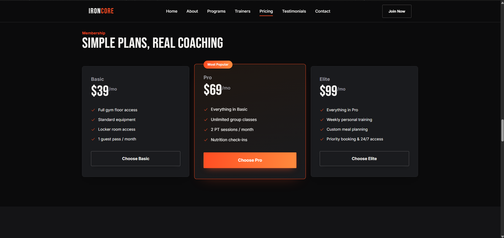
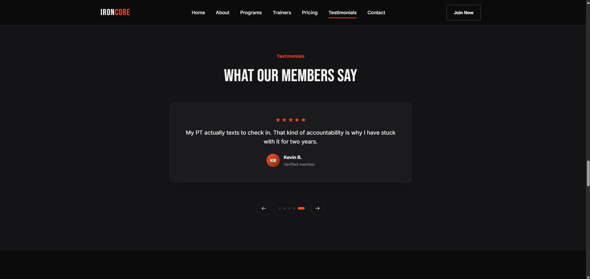

# Html5 + CSS3  + JavaSript

A modern, responsive landing page built with pure **HTML5** and **CSS3**. This showcase website highlights gym services, facility photos, and membership details across desktop and mobile devices without external frameworks or dependencies.

# 🏋️‍♂️ IRONCORE Strength Gym

**Welcome to the IRONCORE Website Landing Page project! This is a fully responsive website designed for a gym using HTML5, CSS3, JavaScript, Heroicons, and FormSubmit to integrate messaging through the contact form to your email. It includes various sections like the home, benefits, our classes, facility showcase, and contact us.**

<hr>
<bold><h1>📸 ScreenShots : - </h1></bold>
<p align="center">






&nbsp;
&nbsp;
</p >
---

## 🛠️ Technologies Used

### Frontend
- **HTML5:** Semantic markup for structured, accessible content across all pages.
- **CSS3:** Custom styling featuring Flexbox, CSS Grid, custom properties (variables), and responsive media queries.
- **JavaScript (ES6+):** Interactive client-side functionality, smooth scrolling, and dynamic DOM manipulation.


## ✨ Features

- **Hero Banner:** Eye-catching section with custom typography and clear call-to-action (CTA) buttons.
- **Image Showcase:** Responsive image grid with modern hover effects to display facility zones and equipment.
- **Services Overview:** Clean sections for personal training, strength coaching, and group fitness classes.
- **Responsive Design:** Mobile-friendly layout built using standard CSS Grid and Flexbox.
- **No Dependencies:** Pure, lightweight static web assets.
---

## 📁 Project Structure

```text
ironcore-gym/
├── index.html        # HTML structure
├── css/
│   └── styles.css    # Custom CSS styles
├── images/           # Gym image assets
└── README.md         # Project documentation
