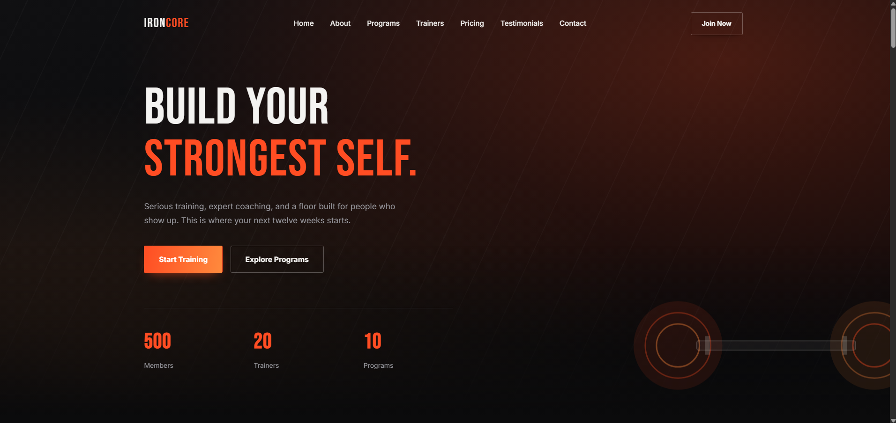

# Html5 + CSS3  + JavaSript

A modern, responsive landing page built with pure **HTML5** and **CSS3**. This showcase website highlights gym services, facility photos, and membership details across desktop and mobile devices without external frameworks or dependencies.




&nbsp;
&nbsp;

---

#  IRONCORE Gym

**Welcome to the **IRONCORE Website Landing Page** project! This is a fully responsive, modern website designed for a gym using **HTML5, CSS3, JavaScript**, and **FormSubmit** for seamless email integration via the contact form. It showcases our state-of-the-art facility, elite coaching programs, and offers an easy way for prospective members to get in touch**


## ✨ Features

- **Hero Banner:** Eye-catching section with custom typography and clear call-to-action (CTA) buttons.
- **Image Showcase:** Responsive image grid with modern hover effects to display facility zones and equipment.
- **Services Overview:** Clean sections for personal training, strength coaching, and group fitness classes.
- **Responsive Design:** Mobile-friendly layout built using standard CSS Grid and Flexbox.
- **No Dependencies:** Pure, lightweight static web assets.
---

## 📁 Project Structure

```text
ironcore-gym/
├── index.html        # HTML structure
├── css/
│   └── styles.css    # Custom CSS styles
├── images/           # Gym image assets
└── README.md         # Project documentation
